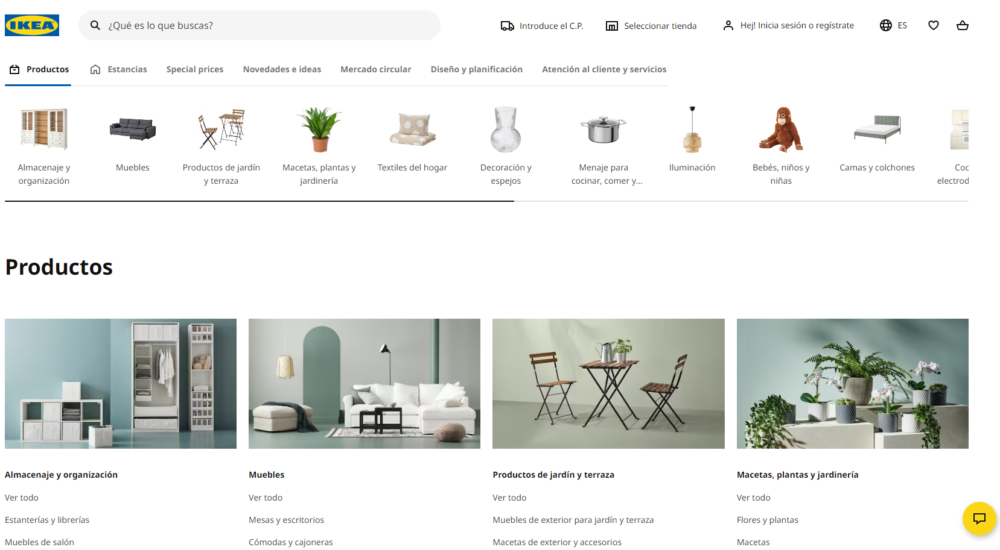

# PRÁCTICA 7 : Modelo de datos de un sistema de información que permite gestionar una tienda de muebles

**Grupo N**
*Nombre y apellidos: [Daniel Bensa Expósito Paz](https://github.com/Danixps?tab=repositories, "Enlace Github")*
*Nombre y apellidos: [Manuel David Gómez Alonso](https://github.com/ManuelDavidGomezAlonso?tab=repositories, "Enlace Github")*
*Nombre y apellidos: [Alejandro Javier Aguiar Pérez](https://github.com/AlejandroJ22?tab=repositories, "Enlace Github")*

*Asignatura: Desarrollo de Sistemas Informáticos (DSI)*

[](https://coveralls.io/github/ULL-ESIT-INF-DSI-2324/ull-esit-inf-dsi-23-24-prct07-dsikea-datamodel-groupn?branch=main)

[](https://github.com/Danixps/ULL-DSI-P7/actions/workflows/node.js.yml)

[Enunciado de la práctica 7](https://ull-esit-inf-dsi-2324.github.io/prct07-DSIkea-dataModel/)



## Índice
1. [Resumen](#resumen)
2. [Apartados](#apartados)
   - [Planteamiento del trabajo](#planteamiento-del-trabajo)
   - [La herramienta LiveShare](#la-herramienta-liveshare)
   - [Github Actions y Flujo de Trabajo Continuo](#github-actions-y-flujo-de-trabajo-continuo)
   - [Clase Furniture](#clase-furniture)
   - [Subclases muebles](#subclases-muebles)
   - [Clase Stock](#clase-stock)
   - [Inquirer](#inquirer)
   - [Lowdb](#lowdb)
3. [Problemas](#alternativas)
4. [Referencias](#referencias)
5. [Anexos](#anexos)

## Resumen
En esta práctica grupal, se nos ha pedido un programa en TypeScript destinado a gestionar una tienda de muebles llamada DSIkea. El código desarrollado se encuentra alojado en este mismo repositorio de Github. 

Algunas de las tareas previas requeridas fueron:

- La aceptación de la asignación grupal en GitHub Classroom y organización en equipos.
- El estudio de los módulos Inquirer.js y Lowdb para la gestión de una línea de comandos interactiva y persistencia de datos respectivamente a través del libro Essential TypeScript, por Adam Freeman.
- Configuración de TypeDoc para documentar nuestro código.
- Desarrollo de pruebas unitarias para garantizar el correcto funcionamiento de nuestro código y su robustez ante entradas no válidas o inesperadas.
- Configuración de las herramientas de cubrimiento de código (Coveralls), integración continua (GitHub Actions) y calidad del código (Sonar Cloud) para mejorar la calidad y fiabilidad de nuestro software.

Los requisitos del sistema que se nos exigían fueron:

- Creación de al menos 20 muebles diferentes.
- Implementación de funcionalidades para añadir, borrar y modificar muebles, proveedores y clientes mediante una línea de comandos interactiva. Para ello debíamos usar Inquirer.js para la interacción con el usuario y Lowdb para la persistencia de datos.
- Desarrollo de métodos para acceder a la información de estas entidades, permitiendo búsqueda por diferentes criterios y ordenación.
- Creación de la clase Stock para gestionar el tratamiento de la información del sistema, incluyendo control de stock, registro de transacciones y generación de informes sobre el stock disponible, ventas, compras y registros históricos de clientes y proveedores.

> **[Volver al índice](#índice)**

## Apartados
- ### Planteamiento del trabajo
Se optó principalmente por crear una clase Furniture que contiene un mapa de muebles, utilizando una interfaz furnitureMap para definir su estructura. Esta clase proporciona métodos para agregar muebles al mapa, obtener un mueble por su identificador y obtener un iterador para recorrer todos los muebles en el mapa.

La interfaz furnitureInterface define la estructura de un mueble, especificando los campos necesarios como ID, nombre, descripción, material, dimensiones y precio. Además, incluye métodos para obtener la información detallada del mueble y su nombre. Está interfaz la deben implementar todos los tipos de muebles, así con ello nos aseguramos de que no haya mueble que no cuente con los atributos básicos y que luego pueda contar con más atributos.

Para representar las dimensiones de un mueble, se utiliza un tipo Dimension que contiene las propiedades de longitud, ancho y altura.

Luego pasamos a crear cada clase de los 20 muebles requeridos, y en los cuales no vamos a profundizar demasiado ya que su estructura es bastante sencilla y la podemos repasar después.

Luego la siguiente decisión importante fue la de como manejar las dos estructuras de datos sobre proveedores y clientes, en principio pensamos en crear dos clases completamente diferentes, pero al ser dos clases que comparían mismos atributos y métodos lo que decidimos fue crear una sola clase de la cual se creen dos instancias (providers y clients). La clase EntityCollection representa una colección de entidades, donde cada entidad tiene un ID único, un nombre, información de contacto y una dirección. Esta clase proporciona métodos para realizar operaciones comunes en la colección de entidades, como encontrar entidades por diferentes campos (nombre, contacto, dirección), agregar nuevas entidades al mapa, obtener todas las entidades del mapa y proporcionar un iterador para recorrer todas las entidades en el mapa. Utiliza un mapa interno para almacenar las entidades, donde la clave es el ID único de la entidad.

Clase EntityCollection:
```ts
/**
 * Interfaz que define la estructura de una entidad.
 * @param id - Identificador único de la entidad.
 * @param name - Nombre de la entidad.
 * @param contact - Información de contacto de la entidad.
 * @param direction - Dirección de la entidad.
 */
export interface EntityInterface {
  id: number;
  name: string;
  contact: string;
  direction: string;
}

/**
 * Interfaz que representa un mapa de entidades.
 * @param entityMap - Mapa que contiene las entidades.
 */
export interface EntityMap<T extends EntityInterface> {
  entityMap: Map<number, T>;
}

/**
 * Clase que representa una colección de entidades.
 */
export class EntityCollection<T extends EntityInterface>
  implements EntityMap<T>, Iterable<T>
{
  /**
   * Constructor de la clase EntityCollection.
   * @param entityMap - Mapa que contiene las entidades.
  */
  constructor(public entityMap: Map<number, T>) {}

  /**
   * Encuentra entidades por un campo específico y un valor dado.
   * @param field - Campo por el cual buscar.
   * @param value - Valor a comparar.
   * @returns Un array de entidades que coinciden con el campo y valor dados.
   */
  findByField(field: keyof T, value: string | number): T[] {
    const results: T[] = [];
    for (const entity of this.entityMap.values()) {
      const fieldValue = entity[field];
      if (typeof fieldValue === "string" && typeof value === "string") {
        if (fieldValue.includes(value)) {
          results.push(entity);
        }
      } else if (fieldValue === value) {
        results.push(entity);
      }
    }
    return results;
  }

  /**
   * Encuentra entidades por nombre.
   * @param name - Nombre a buscar.
   * @returns Un array de entidades con el nombre especificado.
   */
  findByName(name: string): T[] {
    return this.findByField("name", name);
  }

  /**
   * Encuentra entidades por contacto.
   * @param contact - Contacto a buscar.
   * @returns Un array de entidades con el contacto especificado.
   */
  findByContact(contact: string): T[] {
    return this.findByField("contact", contact);
  }

  /**
   * Encuentra entidades por dirección.
   * @param direction - Dirección a buscar.
   * @returns Un array de entidades con la dirección especificada.
   */
  findByDirection(direction: string): T[] {
    return this.findByField("direction", direction);
  }

  /**
   * Método de iteración para la clase EntityCollection.
   * @returns Un iterador de las entidades en el mapa.
   */
  [Symbol.iterator](): IterableIterator<T> {
    return this.entityMap.values();
  }

  /**
   * Añade una entidad al mapa.
   * @param entity - La entidad a añadir.
   */
  add(entity: T): void {
    this.entityMap.set(entity.id, entity);
  }

  /**
   * Obtiene todas las entidades del mapa.
   * @returns Un array de todas las entidades en el mapa.
   */
  getAll() {
    return Array.from(this.entityMap.values());
  }
}
```

Respecto a la clase Stock definimos una clase que gestiona el inventario y las transacciones de una tienda de muebles, permitiendo agregar productos, registrar ventas y compras, y obtener información sobre el inventario y las transacciones.

A su vez cada vez que se realiza la operación de compra o de venta se hace una facturación simple que se manifiesta en formato de la clase Transaction:

```ts
/**
 * Definimos un tipo para representar los tipos de transacción.
 */
type TransactionType = "Venta" | "Compra";

/**
 * Clase para representar una transacción.
 */
export class Transaction<T extends furnitureInterface> {
  /**
   * @param entity - La entidad relacionada con la transacción (cliente/proveedor).
   * @param type - El tipo de transacción (Venta/Compra).
   * @param date - La fecha de la transacción.
   * @param furnitures - Los muebles involucrados en la transacción.
   * @param total - El importe total de la transacción.
   */
  constructor(
    public entity: EntityInterface,
    public type: TransactionType,
    public date: Date,
    public furnitures: Furniture<T>,
    public total: number,
  ) {}

  /**
   * Método para mostrar la información de la transacción por consola.
   */
  displayInfo() {
    console.log(`Entidad: ${this.entity.name}`);
    console.log(`Tipo de transacción: ${this.type}`);
    console.log(`Fecha: ${this.date}`);
    console.log("Muebles involucrados:");
    let counter: number = 0;
    for (const furniture of this.furnitures) {
      console.log(`  ${++counter}. ${furniture.getName()}`);
    }
    console.log(`Importe total: ${this.total}`);
  }
}
```

Tanto el menú como la base de datos se describiran con mayor detalle posteriormente.

> **[Volver al índice](#índice)**

- ### La herramienta LiveShare
Este trabajo es el primero que realizamos de forma grupal en esta asignatura, así que necesitabamos una manera de poder trabajar todos al mismo tiempo, en eso se resume la importancia que tuvó para nosostros la herramienta LiveShare para nuestro programa. Ya en la asignatura se había contemplado el uso de LiveShare aunque esta es la primera vez que lo usamos de manera seria. Gracias al uso de esta herramienta junto con GitHub conseguimos poder implementar una forma de trabajar de la forma más cómoda posible sin retrasos. La única pega que podríamos tener del uso de esta herramienta es que solo una persona es la que puede compliar o ejecutar en terminal (ya que esto se hace por seguridad) e incluso tener acceso a diferentes directorios como lo es el directorio donde se ejecuta el programa /dist.
> **[Volver al índice](#índice)**

- ### Github Actions y Flujo de Trabajo Continuo
Desde hace unas semana hemos ido repasando en clase como se puede mejorar 
la calidad del desarrollo de software mediante la implementación de GitHub Actions y un flujo de trabajo continuo. En este contexto, se ha diseñado un flujo de trabajo en GitHub Actions para automatizar diversas tareas, como la ejecución de pruebas automatizadas, la generación de informes de cobertura de código y la ejecución de análisis estático del código utilizando herramientas como SonarCloud, que es una plataforma en la nube que proporciona análisis estático de código para mejorar la calidad y seguridad del software. Ofrece diversas herramientas de inspección de código que identifican problemas, bugs, vulnerabilidades y áreas de mejora en el código fuente. Este flujo de trabajo garantiza que el código desarrollado cumpla con los estándares de calidad definidos y que cualquier cambio realizado en el repositorio sea sometido a una serie de pruebas automáticas antes de ser fusionado en la rama principal.

Además, se ha establecido una integración continua para garantizar que el código se construya correctamente en cada confirmación y que se despliegue en un entorno de prueba para su evaluación. Esto permite detectar y corregir rápidamente posibles problemas de integración, así como validar nuevas funcionalidades antes de su implementación en producción. Mediante el uso de GitHub Actions, se ha logrado automatizar gran parte del proceso de desarrollo y despliegue de software, lo que contribuye a una mayor eficiencia y confiabilidad en el desarrollo de la aplicación DSIkea.

> **[Volver al índice](#índice)**

- ### Clase Furniture
Ya hemos hablado anteriormente de la clase Furniture aunque podemos profundizar aún más sobre esta clase. Furniture es en pocas palabras un catalogo que se construye con un id asociado a un mueble en la estructura de datos Map. Además la clase al basarse en un, Map al fin y al cabo, hemos decidido implementar la interfaz Iterable<T>, lo que permite recorrer los muebles contenidos en el mapa, estamos hablando de una clase que es iterable. Poco más que decir al respecto con Furniture:
- Implementa una manera de añadir muebles a la clase:

```ts
/**
 * Agrega un mueble al mapa.
 * @param id - Identificador del mueble.
 * @param furniture - Mueble a agregar.
 */
furnitureAdd(id: number, furniture: T): void {
  this.furnitureMap.set(id, furniture);
}
```

- Implementa una manera de buscar muebles en la clase por su ID:

```ts
/**
 * Obtiene un mueble por su identificador.
 * @param id - Identificador del mueble.
 * @returns El mueble correspondiente al identificador, si existe; de lo contrario, undefined.
 */
getFurniture(id: number): furnitureInterface | undefined {
  if (this.furnitureMap.get(id) === undefined) {
    return undefined;
  } else {
    return this.getKey(id); 
  }
}
```

Esta clase guarda muebles de diferentes tipos, todos los definidos en /furnitures y que implementan la interfaz de muebles, furnitureInterface.

> **[Volver al índice](#índice)**
- ### Clase Stock

La clase Stock se encarga de gestionar el inventario de muebles y las transacciones relacionadas en una tienda de muebles. Está compuesta por varios atributos, como inventory para almacenar la cantidad de cada mueble en el inventario, catalogue para la colección de muebles disponibles, transactions para almacenar las transacciones realizadas, clients para la colección de clientes y providers para la colección de proveedores.

Los métodos principales de esta clase son los siguientes que ya vienen comentados por lo cuál no creemos que haga falta explicarlos en profundidad:

```ts
/**
 * Método para agregar productos al catálogo e inventario.
 * @param product - Mueble a agregar.
 * @param quantity - Cantidad del mueble a agregar.
 */
addProduct(product: furnitureInterface, quantity: number): void {
  this.catalogue.furnitureAdd(product.id, product);
  const currentQuantity = this.inventory.get(product.id) || 0;
  this.inventory.set(product.id, currentQuantity + quantity);
}

/**
 * Método para vender una cantidad de productos a un cliente.
 * @param client - Cliente al que se vende.
 * @param products - Muebles a vender.
 * @returns La transacción de venta si se realiza con éxito; de lo contrario, undefined.
 */
sellProduct(
  client: EntityInterface,
  products: Furniture<furnitureInterface>,
): Transaction<furnitureInterface> | undefined {
  let total: number = 0;
  if (products && typeof products[Symbol.iterator] === 'function') {
  for (const product of products) {
    // Por cada producto que se quiera vender, comprobar la existencia y restar la cantidad si es posible.
    const currentQuantity = this.inventory.get(product.id) || 0;
    if (currentQuantity < 1) {
      console.log(
        `No hay suficiente stock de las unidades de ${product.name}`,
      );
      return undefined;
    }

    // Actualizar la cantidad en el inventario
    this.inventory.set(product.id, currentQuantity - 1);
    total += product.price;
  }
} else {
  console.error('products is not iterable');
}

  // Crear la transacción de venta
  const saleTransaction = new Transaction(
    client,
    "Venta",
    new Date(),
    products,
    total,
  );
  this.clients.entityMap.set(client.id, client);
  this.transactions.push(saleTransaction);
  return saleTransaction;
}

/**
 * Método para registrar una compra a un proveedor.
 * @param provider - Proveedor al que se compra.
 * @param products - Muebles comprados.
 * @param totalPrice - Precio total de la compra.
 * @returns La transacción de compra.
 */
purchaseProduct(
  provider: EntityInterface,
  products: Furniture<furnitureInterface>,
  totalPrice: number,
): Transaction<furnitureInterface> {
console.log('products:', products);
console.log('products.furnitureMap:', products.furnitureMap);
    // for (const product of products.furnitureMap.forEach
    //     let currentQuantity = this.inventory.get(product.id) || 0;
    //     this.inventory.set(product.id, ++currentQuantity);
    // } //error aqui
    const furnitureMap = new Map();
    furnitureMap.set(1, { productName: 'papas', productDescription: 'lays' });
    let products1 = new Furniture(furnitureMap);
    
    for (const [key, value] of products1.furnitureMap.entries()) {
      let currentQuantity = this.inventory.get(key) || 0;
      this.inventory.set(key, ++currentQuantity);
    }
    console.log('this.inventory:', this.inventory);
  const purchaseTransaction = new Transaction(
    provider,
    "Compra",
    new Date(),
    products,
    totalPrice,
  );

  this.transactions.push(purchaseTransaction);
  console.log('this.transactions:', this.transactions);
  return purchaseTransaction;
}

/**
 * Método para obtener el stock disponible de un mueble específico.
 * @param furnitureId - ID del mueble.
 * @returns La cantidad disponible en el inventario del mueble especificado.
 */
getStockForFurniture(furnitureId: number): number {
  return this.inventory.get(furnitureId) || 0;
}

/**
 * Método para obtener el mueble más vendido.
 * @returns El mueble más vendido, o undefined si no hay ventas.
 */
getMostSoldFurniture(): furnitureInterface | undefined {
  let mostSoldFurniture: furnitureInterface | undefined = undefined;
  let maxQuantitySold = 0;

  for (const [id, quantity] of this.inventory.entries()) {
    const furniture = this.catalogue.getFurniture(id);
    if (furniture && quantity > maxQuantitySold) {
      maxQuantitySold = quantity;
      mostSoldFurniture = furniture;
    }
  }

  return mostSoldFurniture;
}

/**
 * Método para obtener la facturación total por ventas a clientes en un periodo de tiempo.
 * @param startDate - Fecha de inicio del periodo.
 * @param endDate - Fecha de fin del periodo.
 * @returns La facturación total por ventas en el periodo especificado.
 */
getRevenueForClientSales(startDate: Date, endDate: Date): number {
  let totalRevenue = 0;
  for (const transaction of this.transactions) {
    if (
      transaction.type === "Venta" &&
      startDate <= transaction.date &&
      transaction.date <= endDate
    ) {
      totalRevenue += transaction.total;
    }
  }
  return totalRevenue;
}

/**
 * Método para obtener el gasto total por compras a proveedores en un periodo de tiempo.
 * @param startDate - Fecha de inicio del periodo.
 * @param endDate - Fecha de fin del periodo.
 * @returns El gasto total por compras a proveedores en el periodo especificado.
 */
getExpenseForProviderPurchases(startDate: Date, endDate: Date): number {
  let totalExpense = 0;
  for (const transaction of this.transactions) {
    if (
      transaction.type === "Compra" &&
      startDate <= transaction.date &&
      transaction.date <= endDate
    ) {
      totalExpense += transaction.total;
    }
  }
  return totalExpense;
}

/**
 * Método para obtener el histórico de ventas de un cliente específico.
 * @param clientId - ID del cliente.
 * @returns Un array con las transacciones de venta del cliente especificado.
 */
getSalesHistoryForClient(
  clientId: number,
): Transaction<furnitureInterface>[] {
  return this.transactions.filter(
    (transaction) =>
      transaction.type === "Venta" && transaction.entity.id === clientId,
  );
}

/**
 * Método para obtener el histórico de compras a un proveedor específico.
 * @param providerId - ID del proveedor.
 * @returns Un array con las transacciones de compra al proveedor especificado.
 */
getPurchasesHistoryForProvider(
  providerId: number,
): Transaction<furnitureInterface>[] {
  return this.transactions.filter(
    (transaction) =>
      transaction.type === "Compra" && transaction.entity.id === providerId,
  );
}
```

Estos métodos permiten realizar operaciones clave para el manejo eficiente del inventario y las transacciones en la tienda de muebles, así como obtener diferentes informes sobre las transacciones.

Lo único que no hemos sido capaces de implementar ha sido la creación de un método capaz de buscar muebles según el tipo que se requiera, ya que para esto nuestra clase debe ser capaz de diferenciar entre distintas clases de muebles, en concreto 20, pensamos que esto se puede implementar usando "instance of", pero claro de esa manera para diferenciar 20 clases necesitaríamos 20 bloque de "if" lo cuál no nos parece la mejor forma de hacerlo.

> **[Volver al índice](#índice)**
- ### Inquirer
Inquirer es una biblioteca de Node.js que facilita la creación de interfaces de línea de comandos interactivas. Permite a los desarrolladores crear preguntas, opciones y solicitudes de entrada de manera sencilla para interactuar con los usuarios en la terminal. Inquirer ofrece una amplia gama de tipos de preguntas y opciones de personalización, lo que la convierte en una herramienta popular para la creación de interfaces de usuario en aplicaciones de línea de comandos.

Es bastante sencillo de utilizar, simplemente se deberán utilizar las funciones que implementa para ello.

- _prompt()_: Sirve para preguntar al usuario.
```typescript
    const answer = await inquirer.prompt({
        type: "list",
        name: "option",
        message: "Selecciona una opción:",
        choices: [
            "Gestionar Muebles",
            "Gestionar Proveedores",
            "Gestionar Clientes",
            "Salir",
        ],
    });
```
_Ese **await** antes del **inquirer.prompt** nos dice hara que la función se ejecute después de que se cumpla una promesa, el **await** se utiliza en funciones asíncronas que se establecen con la palabra reservada **async**_

```typescript
    switch (answer.option) {
    case "Gestionar Muebles":
        await manageFurniture();
        break;
    case "Gestionar Proveedores":
        await manageProviders();
        break;
    case "Gestionar Clientes":
        await manageClients();
        break;
    case "Salir":
        console.log("¡Hasta luego!");
        process.exit();
    break;
    }
```

_De la manera anterior manejaremos el funcionamiento de según que elección del usuario._   

Disponemos de más funciones pero no hemos visto necesaria ninguna más, alguna de ellas son las siguientes:

- __registerPrompt():__ Permite registrar nuevos tipos de prompts personalizados para extender las capacidades de Inquirer.
- __Separator():__ Se utiliza para agregar separadores entre las preguntas para una mejor organización visual en la interfaz de línea de comandos.
- __createPromptModule():__ Permite crear un módulo personalizado de Inquirer con opciones preconfiguradas para reutilizar en diferentes partes de la aplicación.
- __prompt.prompts:__ Un objeto que contiene los tipos de prompts disponibles, como input, confirm, list, etc. Este objeto se puede utilizar para acceder y personalizar los tipos de prompts predeterminados.
- __prompt.override:__ Se utiliza para anular las opciones predeterminadas de un prompt específico, como el mensaje, las opciones de selección, etc.
- __prompt.registerPrompt():__ Permite registrar nuevos tipos de prompts a nivel global para usarlos en toda la aplicación.
- __prompt.ui:__ Un objeto que representa la interfaz de usuario de Inquirer. Se utiliza para iniciar y finalizar la interfaz, así como para manejar eventos y entradas del usuario.

> **[Volver al índice](#índice)**
- ### Lowdb

lowdb es una biblioteca de base de datos escrita enteramente en JavaScript y que opera sobre archivos JSON. Es una solución liviana y simple para almacenar datos en aplicaciones __Node.js__ y del lado del cliente. Está diseñada para _aplicaciones pequeñas a medianas que no requieren una base de datos completa_, como SQLite o MongoDB.

```typescript
export class JsonStock extends Stock {
  private database: lowdb.LowdbSync<SchemaType>;
  private nextId: number = 0;
  /**
   * Constructor de la clase JsonStock.
   * Inicializa la base de datos y carga los datos si existen.
   */
  constructor() {
    super();
    this.database = lowdb(new FileSync("Stock.json"));
    if (this.database.has("inventory").value()) {

      this.inventory = this.database.get("inventory").value();
      this.transactions = this.database.get("trans").value();
      this.clients = this.database.get("clients").value();
      this.providers = this.database.get("providers").value();
      this.catalogue = new Furniture(new Map());
      //¡this.catalogue = this.database.get("furniture").value();
      this.inventory = new Map(); // Asegúrate de que esto es correcto para tu caso
      // this.catalogue = this.database.get("furniture").value();
    } else {
      const entrada: SchemaType = {
        inventory: this.inventory,
        trans: this.transactions,
        clients: this.clients,
        providers: this.providers,
        furniture: this.catalogue,
      };
  
      this.database.set("inventory", entrada.inventory)
      .set("trans", entrada.trans)
      .set("clients", entrada.clients)
      .set("providers", entrada.providers)
      .set("catalogue", entrada.furniture).write();
    }
  }
```
Lo que se hace es una clase que maneje la base de datos, en el constructor de esta __contemplamos la opción de que la base de datos contenga algo__, cogiendo los datos de esta y haciendo que nuestro objeto tenga los valores guardados en la misma, __o que esté vacía inicializando entonces la misma__, y creando el fichero JSON con su respectiva estructura.

> **[Volver al índice](#índice)**
## Problemas
__Hemos tenido varios problemas debido al desconocimiento previo de lowdb:__

- __lowdb:__ Al intentar crear tan solo un json que almacene todos los datos, nos dan errores las funciones de otras clases a las que no extiende nuestra clase JsonStock. Por ejemplo cunado intentamos convocar el método addProduct de la clase stock, en el cual se utiliza __getKey() de la clase Furniture__ para saber si hay que añadir el mueble al listado o no, nos da un error ya que __getKey() no pertenece a JsonStock__, dandonos cuenta de que __para cada clase contenedora debemos crear un json.__

- __stock:__ Debido a no tener en cuenta la base de datos a la hora de su implementación, para el correcto funcionamiento de todo el código tendríamos que hacer cambios muy bruscos sobre esta clase, creemos que una de las soluciones podría ser pasarle a su constructor tres objetos que implementan 3 bases de datos, la de los muebles, la de los clientes y la de los proveedores.


> **[Volver al índice](#índice)**
## Referencias

[Inquirer](#https://www.npmjs.com/package/inquirer)
[Lowdb](#https://www.npmjs.com/package/lowdb)
[SonarCloud](#https://github.com/marketplace/actions/sonarcloud-scan)

> **[Volver al índice](#índice)**
## Anexos
[Essential TypeScript](#https://learning-oreilly-com.accedys2.bbtk.ull.es/library/view/essential-typescript-from/9781484249796/html/481342_1_En_1_Chapter.xhtml)

> **[Volver al índice](#índice)**
